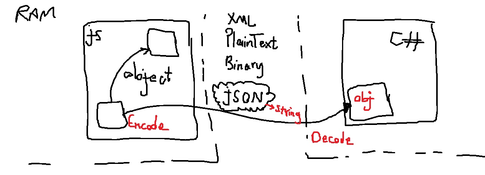
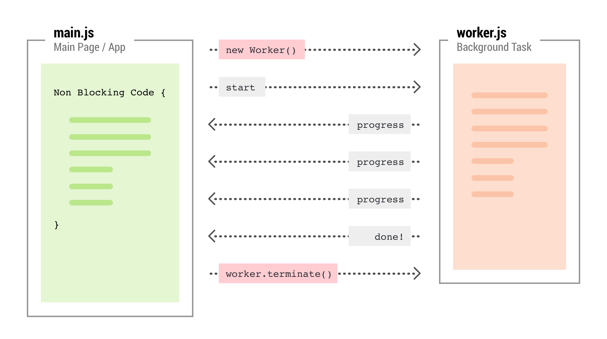
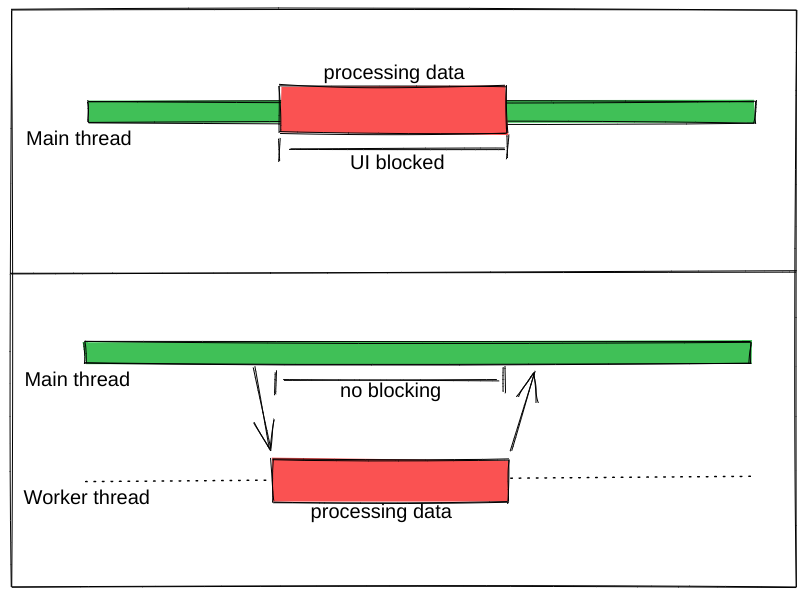
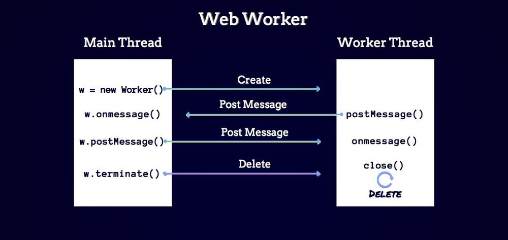
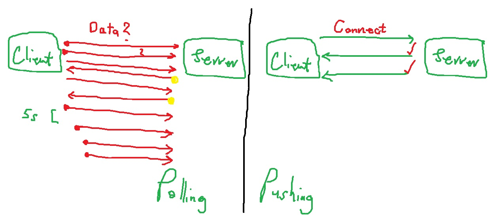
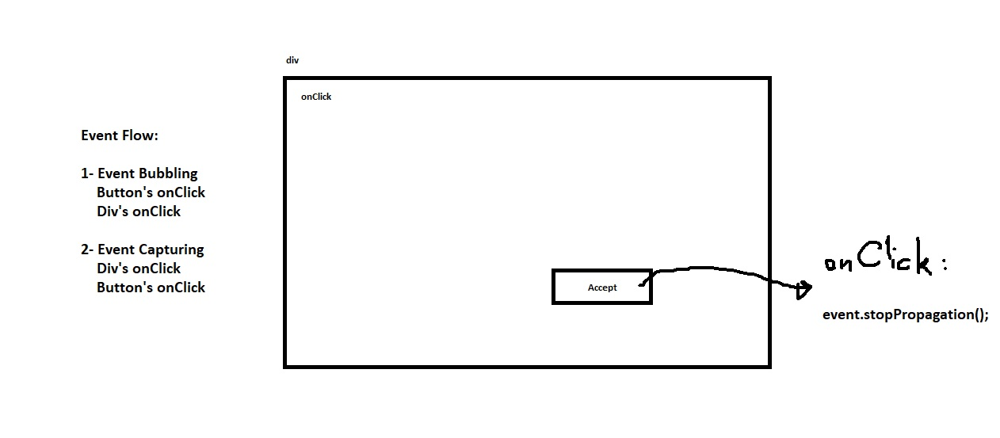
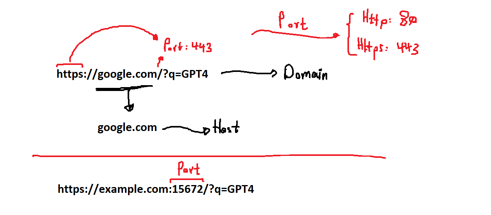
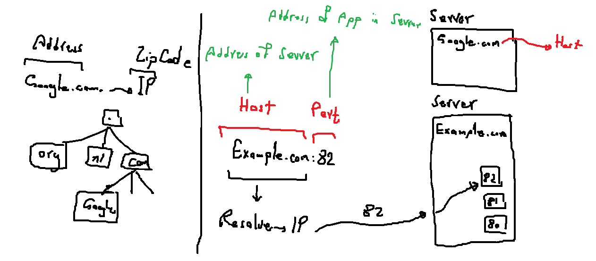
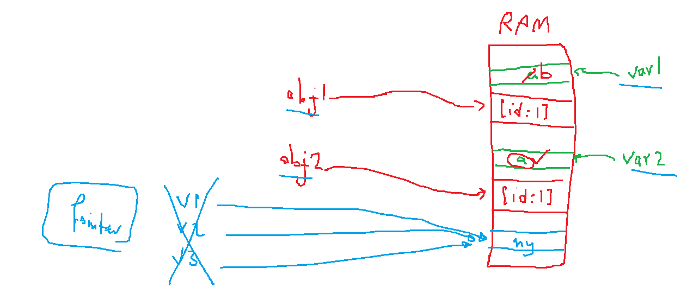

# js-interview

## 001
### Static Methods vs Normal Methods (ts)
#### Normal method
```js
const obj1 = new Person("Alex")
const obj2 = new Person("Jorien")
obj1.print(); // Alex
obj2.print(); // Jorien
```

#### Static method:
```js
Person.create(); // Creates an object of type Person
Person.create(); // Same as the above statement
```

## 003
### Call
`Call` changes the method's context

`Apply` is same as `Call`, except it accepts parameters as an array

`Bind` creates a method which is uses the object as its context permanently

## 004


Encode: `JSON.stringify(obj);`
Decode: `JSON.parse(string);`

## 010
### Function

#### Use cases:
1. Define and call a function
2. Define and use in map function

#### Named Function
```js
function process(item) {
    ...
}
```

##### Examples
```js 
    // Define
    function process(item) {
        ...
    }

    // Call
    process(obj);

    // Use in map
    arr.map(process);
```
   
**Define and use in map function**

#### Arrow Function (lambda)
```js
(item) => {
    ...
}
```
##### Examples

```js 
    // Define
    const process = (item) => {
        ...
    }

    // Call
    process(obj);

    // Use in map
    // Solution 1
    arr.map((item) => {

    });

    // Solution 2
    arr.map(process);
```

#### Anonymous Function
```js
(name) {
    ...
}
```

##### Examples

```js 
    // Define
    const process = function(item) {
        ...
    }

    // Call
    process(obj);

    // Use in map
    // Solution 1
    arr.map(function(item) {

    });

    // Solution 2
    arr.map(process);
```

### Isolate JS codes
```js
{
  let name = "A";
  console.log(name);
}

{
  let name = "B";
  console.log(name);
}
```

## Web Workers


[experoinc.com](https://www.experoinc.com/expero-resources/getting-started-with-web-workers-via-webpack)


[velotio.com](https://www.velotio.com/engineering-blog/create-faster-ui-in-react-apps-with-web-workers)


[hongkiat.com](https://www.hongkiat.com/blog/web-workers-javascript-api/)

## Polling vs Pushing


## Event Flow (Bubbling / Capturing)


## Domain - Host - Port - IP





## JSON - XML - Protobuf representation
JSON
```json
{
  "id": 1,
  "name": "aref",
  "books": ["book1", "book2", 1, 2.0, true],
  "university": { "id": 111, "name": "Tehran" }
}
```

XML
```xml
<?xml version="1.0" encoding="UTF-8" ?>
<root>
  <id>1</id>
  <name>aref</name>
  <books>book1</books>
  <books>book2</books>
  <books>1</books>
  <books>2</books>
  <books>true</books>
  <university>
    <id>111</id>
    <name>Tehran</name>
  </university>
</root>
```

Protobuf
Definition:
```cs
message AutoGenerate {
	uint32 id = 1;
	string name = 2;
	repeated string books = 3;
	message University {
		uint32 id = 1;
		string name = 2;
	}
	University university = 4;
}
```

Data: 
```cs
\x08\x01\x12\x04\x04\x00\x12\x00\x1A\x0B\n\x04name\x12\x04\x61\x72\x65\x66\n\x15\n\x05books\x12\x0E\n\x03\x62\x6F\x6F\x6B\x31\x12\x03\x62\x6F\x6F\x6B\x32\x12\x01\x31\x12\x03\x32\x2E\x30\x12\x01\x74\n+\n\tuniversity\x12\x1A\n\x02id\x12\x03\x31\x31\x31\x12\x04\n\x04name\x12\x06\x54\x65\x68\x72\x61\x6E
```

## Memory


## Async - Sync
~[](./assets/aysnc-sync.png)


## Adding a new method to an object (ex. String)

```js
String.prototype.customFunc = function() {
    return this + "!!!";
}

"Hello".customFunc()
// Output: 'Hello!!!'

"asdasdasdasd".customFunc()
// Output: 'asdasdasdasd!!!'
```

> TODO: Learn more about `proto` and `prototype`

